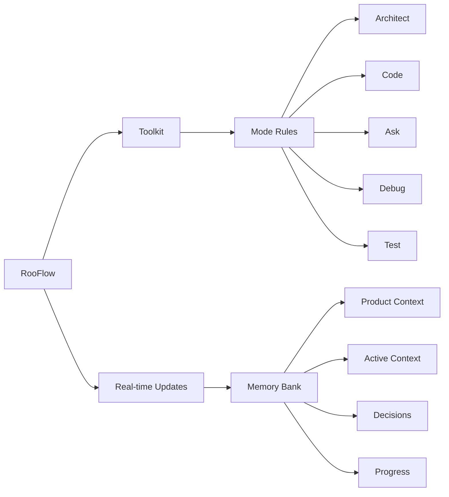

# NOTE: This is Work in Progress and not yet stable enough for external use.

# Vibe-Coder
Vibe Coding with Cursor, Windsurf, RooCode, Cline, Copilot, and Claude-Dev. May the best coder win!!!

# Key Improvements to AI Tools' Memory Banks

*   **Reduced Token Consumption:** Optimized prompts and instructions minimize token usage.
*   **Five Integrated Modes:**  Architect, Code, Test, Debug, and Ask modes work together seamlessly.
*   **Simplified Setup:**  Easier installation and configuration.
*   **Streamlined Real-time Updates:**  More efficient and targeted Memory Bank updates.
*   **Clearer Instructions:**  Improved YAML-based rule files for better readability and maintainability.

### Key Components

- 🧠 **Memory Bank**: Persistent storage for project knowledge (automatically managed).
- 💻 **System Prompts**: YAML-based core instructions for each mode.
- 🔧 **VS Code Integration**: Seamless development experience within VS Code.
- ⚡ **Real-time Updates**:  Automatic Memory Bank updates triggered by significant events.

# Inspired by and References

## RooCode Memory Bank
Inspired by https://github.com/GreatScottyMac/roo-code-memory-bank

## Windosurf Cascade Memory Bank
Inspired by https://github.com/GreatScottyMac/cascade-memory-bank

## RooFlow
Inspired by https://github.com/GreatScottyMac/RooFlow

## Tips and Tricks
Reference: https://github.com/Michaelzag/RooCode-Tips-Tricks

## Devin Rules
Reference: https://github.com/grapeot/devin.cursorrules

## Cursor Memory Bank Rules
Reference: https://gist.github.com/ipenywis/1bdb541c3a612dbac4a14e1e3f4341ab

## RooCode Docs
Reference: https://docs.roocode.com/

## Windsurf Rules Bank
Reference: https://windsurf.run/

## RooFlow Installer
Inspired by: https://github.com/amir-arad/rooflow

