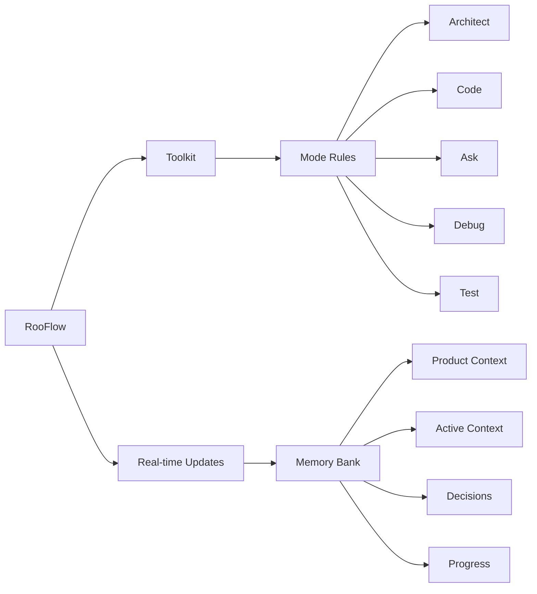

# NOTE: This is Work in Progress and not yet stable enough for external use!!!


# Vibe-Coder
Vibe Coding with Cursor, Windsurf, RooCode, Cline, Copilot, and Claude-Dev. May the best coder win!!!

# Key Improvements to AI Tools' Memory Banks

*   **Reduced Token Consumption:** Optimized prompts and instructions minimize token usage.
*   **Five Integrated Modes:**  Architect, Code, Test, Debug, and Ask modes work together seamlessly.
*   **Simplified Setup:**  Easier installation and configuration.
*   **Streamlined Real-time Updates:**  More efficient and targeted Memory Bank updates.
*   **Clearer Instructions:**  Improved YAML-based rule files for better readability and maintainability.

### Key Components



- 🧠 **Memory Bank**: Persistent storage for project knowledge (automatically managed).
- 💻 **System Prompts**: YAML-based core instructions for each mode.
- 🔧 **VS Code Integration**: Seamless development experience within VS Code.
- ⚡ **Real-time Updates**:  Automatic Memory Bank updates triggered by significant events.

## Installation

Adding RooFlow to your project is simple:

```bash
npm install --save-dev ez-vibecoder
```

Or with yarn:

```bash
yarn add --dev ez-vibecoder
```

That's it! This installer will:

1. Download all the necessary configuration files for RooCode, Cline, Cursor, and Windsurf from the official repositories
2. Set up the proper directory structure in your project
3. Fix duplicate `capabilities` YAML sections in configuration files
4. Validate the YAML structure of system prompt files
5. Configure everything to work with VS Code's Roo Code extension

## Requirements

- VS Code with the Roo Code extension installed
- Node.js

## Manual Installation

If the automatic installation doesn't run (which may happen if npm scripts are disabled in your environment). Please note that if destination files already exist, they wont be overwritten. If you intend to get the latest, please manually delete the files before installation. If your folder doesnt already contain node_modules, it will copy to the root folder of your computer:

```bash
npm i ez-vibecoder

node node_modules/ez-vibecoder/installer.js
```

## After Installation

Start enjoying RooFlow immediately:

1. Open your project in VS Code / Cursor / or WindSurf
2. Start a new RooCode/Cline chat and select any of the five integrated modes
3. Experience the benefits of persistent context and optimized workflows!

For full usage instructions, refer to the [original RooFlow documentation](https://github.com/GreatScottyMac/RooFlow).

# Inspired by and References

## RooCode Memory Bank
Inspired by https://github.com/GreatScottyMac/roo-code-memory-bank

## Windosurf Cascade Memory Bank
Inspired by https://github.com/GreatScottyMac/cascade-memory-bank

## RooFlow
Inspired by https://github.com/GreatScottyMac/RooFlow

## Tips and Tricks
Reference: https://github.com/Michaelzag/RooCode-Tips-Tricks

## Devin Rules
Reference: https://github.com/grapeot/devin.cursorrules

## Cursor Memory Bank Rules
Reference: https://gist.github.com/ipenywis/1bdb541c3a612dbac4a14e1e3f4341ab

## RooCode Docs
Reference: https://docs.roocode.com/

## Windsurf Rules Bank
Reference: https://windsurf.run/

## RooFlow Installer
Inspired by: https://github.com/amir-arad/rooflow


## License

[Apache 2.0](LICENSE)